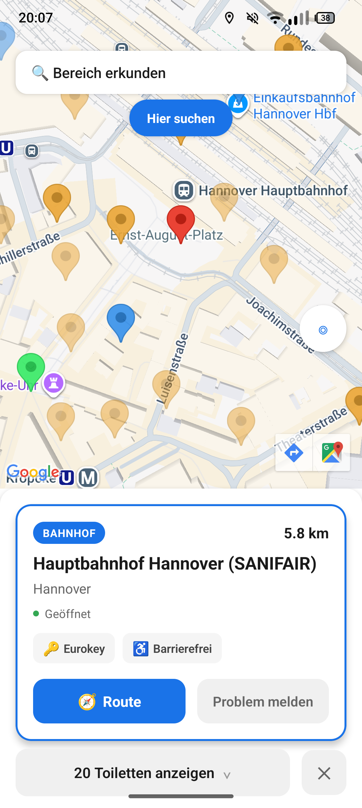
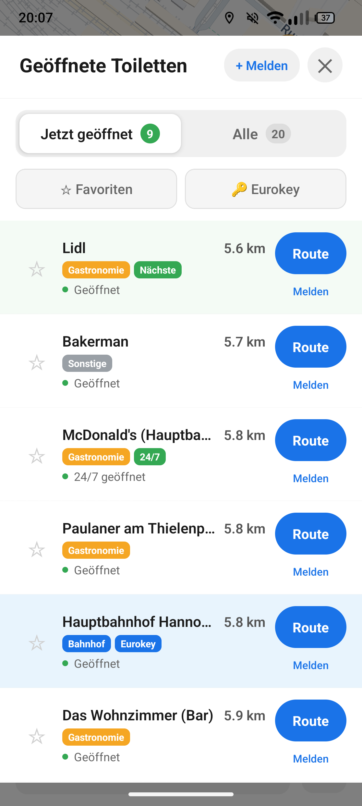
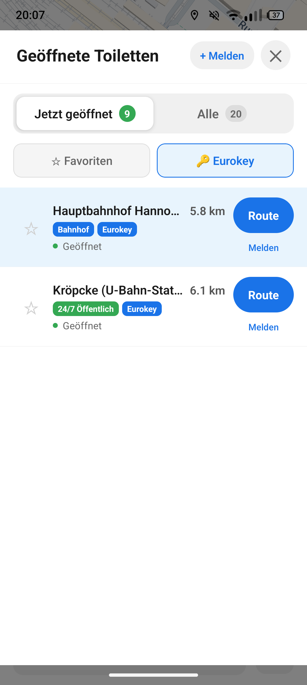

# WC Finder

[](https://github.com/saschb2b/wc-finder/releases/latest)
[](https://github.com/saschb2b/wc-finder/actions)

[Website](https://saschb2b.github.io/wc-finder/) • [Releases](https://github.com/saschb2b/wc-finder/releases)

A free, offline-first toilet finder for wheelchair users in Germany, Austria, and Switzerland.

Find the nearest accessible toilet with real-time opening hours, Eurokey access info, and one-tap navigation.

---

## 📱 Download

### [⬇️ Download Latest APK](https://github.com/saschb2b/wc-finder/releases/latest)

**Requirements:**
- Android 6.0+ (API level 23)
- Location permission (for finding nearest toilets)

**Installation:**
1. Download `wc-finder.apk` from the latest release
2. Open the file on your Android device
3. Allow installation from unknown sources if prompted

---

## Features

- **39,000+ toilets** — Largest database of wheelchair-accessible toilets in DACH (Germany, Austria, Switzerland)
- **5 categories** — Public 24/7, train stations, gas stations, restaurants, and more
- **Real-time status** — "Geöffnet", "Geschlossen", or "Öffnet in 2h"
- **Eurokey filter** — Find toilets with Eurokey access
- **Barrierefrei filter** — Wheelchair accessible locations only
- **Offline support** — All data bundled in the app, works without internet
- **Instant launch** — Cached location shows map in under a second
- **Auto-loading map** — Toilets load automatically as you pan
- **One-tap navigation** — Open Google Maps, Apple Maps, or Waze
- **Favorites** — Save trusted locations for quick access

---

## Data Sources

Toilet locations are merged and deduplicated from:

| Source | Count | Description |
|--------|-------|-------------|
| **OSM / toilettenhero** | 13,000+ | Wheelchair-accessible toilets from OpenStreetMap |
| **Google Places** | 29,000+ | Restaurants, cafés, gas stations across 82 major + 171 smaller DACH cities |
| **Autobahn GmbH API** | 1,700+ | Official highway rest areas with toilets |
| **Sanifair / DB stations** | 770+ | Train station toilets from OSM |
| **Stadt Dortmund** | 150+ | Official open data |
| **Hannover TFA** | 400+ | Toiletten für Alle + local businesses |
| **Manual Curation** | 100+ | Verified locations at stations, malls, hospitals |

**Coverage:**
- 39,870 total toilets across Germany, Austria, and Switzerland
- 3,552 open 24/7
- 21,321 restaurants/cafés with accessible restrooms
- 9,216 gas stations
- 890 public 24/7 toilets (Euroschlüssel)
- 570 train stations
- All data bundled offline — no API calls at runtime

---

## Screenshots

<p align="center">
  
  
  
</p>

| Map View | List View | Filters |
|----------|-----------|---------|
| Interactive map with toilet markers and detail cards | Sortable list with real-time open/closed status | Filter by Eurokey, wheelchair access, free entry |

---

## Development

```bash
# Install dependencies
pnpm install

# Start development server
pnpm start
```

Scan the QR code with [Expo Go](https://expo.dev/go), or press `a` for Android emulator.

### Data Pipeline

```bash
# Fetch all sources
pnpm exec tsx scripts/fetch-toilets.ts                    # toilettenhero.de
pnpm exec tsx scripts/fetch-overpass-toilets.ts            # OpenStreetMap
pnpm exec tsx scripts/fetch-tfa.ts                         # Toiletten für Alle
pnpm exec tsx scripts/fetch-dortmund.ts                    # Stadt Dortmund
pnpm exec tsx scripts/fetch-autobahn-rest.ts               # Autobahn rest areas (govt API)
pnpm exec tsx scripts/fetch-station-toilets.ts             # Train stations / Sanifair
pnpm exec tsx scripts/fetch-google-places-germany.ts       # Google Places (82 major cities, use --tier 1|2|3 for expanded radii)
pnpm exec tsx scripts/fetch-google-places-small-cities.ts  # Google Places (171 smaller cities)

# Merge and normalize
pnpm exec tsx scripts/merge-sources.ts           # Deduplicate + categorize
pnpm exec tsx scripts/migrate-hours-format.ts    # Normalize opening hours

# Generate tiles
pnpm exec tsx scripts/split-tiles.ts             # Geo-tiles
pnpm exec tsx scripts/gen-tile-loader.ts         # Tile loader
```

### Building

```bash
# Local preview build
eas build --platform android --profile preview

# Production build
eas build --platform android --profile production
```

### Releasing

```bash
# Tag triggers release workflow
git tag v1.2.0
git push origin v1.2.0
```

GitHub Actions automatically builds and publishes the APK.

---

## Architecture

- **React Native + Expo SDK 54**
- **Offline-first**: All toilet data in JSON geo-tiles (1° × 1°)
- **Standardized hours format**: Structured data instead of parsing strings
- **No external APIs at runtime**: All data bundled at build time

### Tech Stack

| Component | Technology |
|-----------|------------|
| Framework | React Native + Expo |
| Maps | react-native-maps (Google Maps) |
| Storage | AsyncStorage (favorites) |
| State | React hooks |
| Data | Static JSON tiles |

---

## Contributing

**Report missing or incorrect toilets:**
1. Tap **"Melden"** in the app
2. [Open an issue](https://github.com/saschb2b/wc-finder/issues)
3. Edit directly on [OpenStreetMap](https://www.openstreetmap.org) (tags: `amenity=toilets`, `wheelchair=yes`)

**Code contributions welcome.** Check [issues](https://github.com/saschb2b/wc-finder/issues) for good first issues.

---

## License

MIT License — Free to use, modify, and distribute.

Data sources: © [OpenStreetMap contributors](https://www.openstreetmap.org/copyright), [Toilettenhero](https://www.toilettenhero.de/), [Autobahn GmbH](https://autobahn.api.bund.dev/), [Google Places API](https://developers.google.com/maps/documentation/places), [Stadt Dortmund](https://opendata.dortmund.de/)
