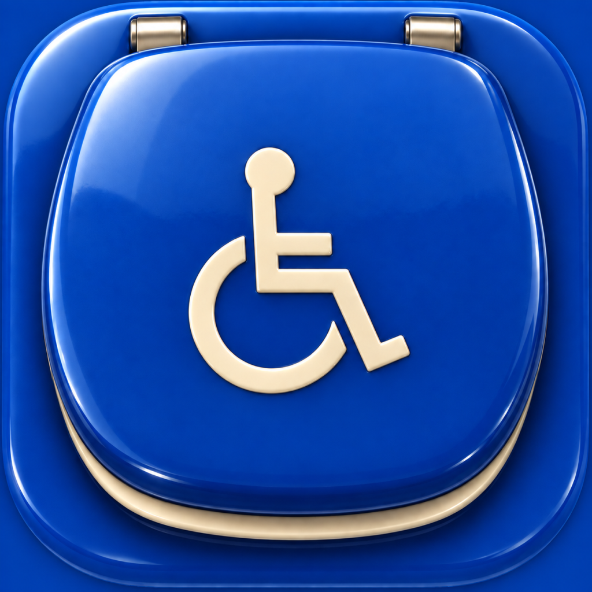

# WC Finder

**Find a toilet that fits your access needs.**

WC Finder helps you look for wheelchair-accessible toilets in Germany, Austria,
and Switzerland. Explore nearby places, check Eurokey access and care equipment,
and save locations you want to find again. The app interface is in German.

**[Download for Android](https://github.com/saschb2b/wc-finder/releases/latest/download/wc-finder.apk)**
 · [Release notes](https://github.com/saschb2b/wc-finder/releases/latest)
 · [Website](https://saschb2b.github.io/wc-finder/)

## Get the app

The app is free and distributed as an Android APK. It requires **Android 7.0 or later**.

1. Download `wc-finder.apk` using the link above.
2. Open it on your phone and allow installation from your browser or file manager if Android asks.
3. Allow location access to find places near you.

An internet connection loads the street map. The toilet directory is included in
the app; see [using it without internet](#using-it-without-internet) below.

## Find what you need

- **Map and list views:** explore an area, compare nearby locations, and open their details.
- **Access filters:** narrow results by Eurokey, wheelchair access, or saved favourites.
- **Care equipment:** filter separately for a **Pflegeliege** (care bed) and **Lifter** (hoist), with access notes and source links where available.
- **Opening hours:** view the recorded schedule or filter for places calculated to be open now.
- **Directions:** open Google Maps on Android for walking directions to a selected location.

A wheelchair-accessible toilet does not necessarily have a care bed or hoist.
Those filters use separate equipment records.

## Using it without internet

**The directory is stored on your phone; the street map is loaded online.**

| Part of the app | Without internet |
| --- | --- |
| Toilet listings, details, and filters | Use the data included in the installed app. |
| Favourites | Saved on your device. |
| Open/closed status | Calculated from stored opening hours and the device clock. |
| Street map | Previously cached areas may appear, but offline maps are not included or downloadable. |
| Directions | Handed to Google Maps. WC Finder does not include an offline route planner. |
| Reports and source links | Need a connection to open the linked websites. |

Finding places near you also needs location permission and an available device
location. A new app release is needed to receive updated toilet data; opening
or refreshing the app does not fetch a live directory.

## Understanding the listings

The directory combines public toilets, specialist care facilities, and locations
at stations, rest areas, restaurants, shops, and other businesses. Coverage and
level of detail vary by source.

Some business records describe an accessible entrance rather than a verified
accessible toilet. The **Rollstuhl** filter follows the imported accessibility
labels, so it is not proof that every listed restroom meets your needs. Opening
status is an estimate from recorded hours, with no live confirmation of closures,
occupancy, or equipment condition.

Specialist entries include separate equipment details, source links, and the date
the directory was checked. Entry fees, key collection, venue access, and event-only
availability are shown in the notes when known. See the [care and event data guide](docs/care-toilets.md).

Sources include OpenStreetMap and toilettenhero, the national and Niedersachsen
**Toiletten für alle** directories, Stadt Dortmund, Autobahn GmbH, Google Places,
Berlin, Hamburg, Rostock, Oldenburg, Münster, and manually curated records. These are combined during maintenance, not queried
when you browse the app.

New imports distinguish confirmed accessible WCs from entrance-only information,
show venue access notes and identify approximate building positions. See the
[data import guide](docs/data-imports.md) for sources, licences and refresh commands.

## Help improve the directory

Use **Melden** in the app or [open an issue](https://github.com/saschb2b/wc-finder/issues/new)
to report a missing place, incorrect hours, or an access problem. Include the
location and what you observed; details about keys, steps, care beds, and hoists
are especially useful. Submitting a GitHub issue requires a GitHub account.

## Work on the app

Built with React Native and Expo. Maps use Leaflet and OpenStreetMap, with no map
API key required. Android is the release target; the project also includes iOS
and web support for development.

Use Node.js 24 and the pnpm version pinned in [package.json](package.json):

```bash
corepack enable
pnpm install --frozen-lockfile
pnpm start
```

Open the project in an Expo Go version compatible with the project's Expo SDK.
Run `pnpm quality` for type checking, lint, and tests.

The [development guide](docs/development.md) covers map changes, data refreshes,
signed APK builds, and releases.

## Licence and attribution

App code: [MIT](LICENSE). Map data: © [OpenStreetMap contributors](https://www.openstreetmap.org/copyright).
Location data comes from the sources listed above; the app's code licence does
not replace their respective data terms.
