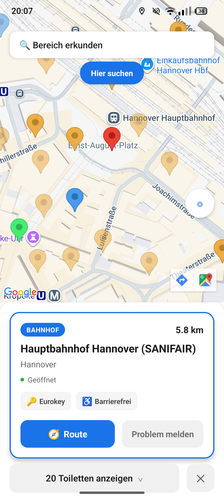
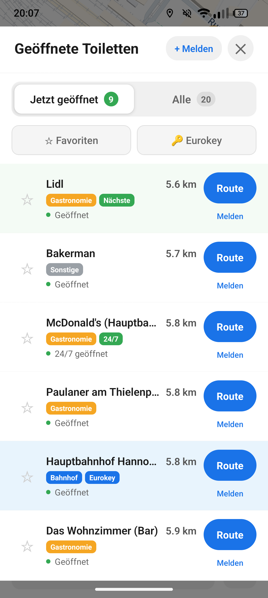
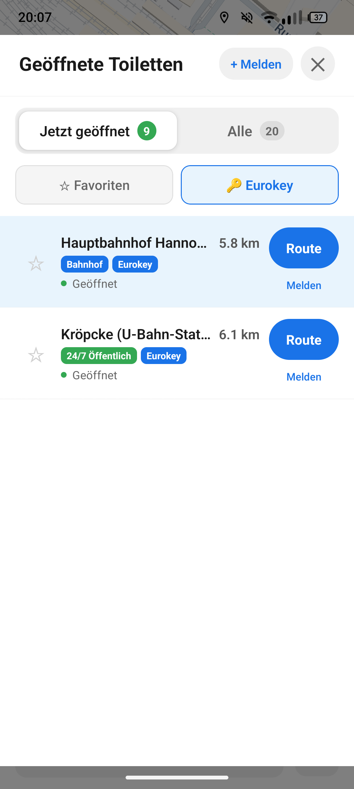

# WC Finder

[](https://github.com/saschb2b/wc-finder/releases/latest)
[](https://github.com/saschb2b/wc-finder/actions)

[Website](https://saschb2b.github.io/wc-finder/) • [Releases](https://github.com/saschb2b/wc-finder/releases)

A free, offline-first toilet finder for wheelchair users in Germany, Austria, and Switzerland.

Find the nearest accessible toilet with real-time opening hours, Eurokey access info, and one-tap navigation.

---

## 📱 Download

### [⬇️ Download Latest APK](https://github.com/saschb2b/wc-finder/releases/latest)

**Requirements:**
- Android 7.0+ (API level 24)
- Location permission (for finding nearest toilets)

**Installation:**
1. Download `wc-finder.apk` from the latest release
2. Open the file on your Android device
3. Allow installation from unknown sources if prompted

---

## Features

- **39,000+ toilets** — Largest database of wheelchair-accessible toilets in DACH (Germany, Austria, Switzerland)
- **5 categories** — Public 24/7, train stations, gas stations, restaurants, and more
- **Real-time status** — "Geöffnet", "Geschlossen", or "Öffnet in 2h"
- **Eurokey filter** — Find toilets with Eurokey access
- **Barrierefrei filter** — Wheelchair accessible locations only
- **Offline support** — Toilet data and map controls are bundled; background maps need an internet connection
- **Instant launch** — Cached location shows map in under a second
- **Auto-loading map** — Toilets load automatically as you pan
- **One-tap navigation** — Open Google Maps, Apple Maps, or Waze
- **Favorites** — Save trusted locations for quick access

---

## Data Sources

Toilet locations are merged and deduplicated from:

| Source | Count | Description |
|--------|-------|-------------|
| **OSM / toilettenhero** | 13,000+ | Wheelchair-accessible toilets from OpenStreetMap |
| **Google Places** | 29,000+ | Restaurants, cafés, gas stations across 82 major + 171 smaller DACH cities |
| **Autobahn GmbH API** | 1,700+ | Official highway rest areas with toilets |
| **Sanifair / DB stations** | 770+ | Train station toilets from OSM |
| **Stadt Dortmund** | 150+ | Official open data |
| **Hannover TFA** | 400+ | Toiletten für Alle + local businesses |
| **Manual Curation** | 100+ | Verified locations at stations, malls, hospitals |

**Coverage:**
- 39,870 total toilets across Germany, Austria, and Switzerland
- 3,552 open 24/7
- 21,321 restaurants/cafés with accessible restrooms
- 9,216 gas stations
- 890 public 24/7 toilets (Euroschlüssel)
- 570 train stations
- All toilet data bundled offline — background map tiles are fetched separately

---

## Screenshots

<p align="center">
  
  
  
</p>

| Map View | List View | Filters |
|----------|-----------|---------|
| Interactive map with toilet markers and detail cards | Sortable list with real-time open/closed status | Filter by Eurokey, wheelchair access, free entry |

---

## Development

Use Node.js 24 LTS (minimum 22.13) and pnpm 10.34.5, pinned in `package.json`.
The repository uses `pnpm-lock.yaml` as its only dependency lockfile.

```bash
# Install dependencies
corepack enable
pnpm install --frozen-lockfile

# Typecheck, lint, and run unit tests
pnpm quality

# Start development server
pnpm start
```

Use an SDK 57-compatible [Expo Go](https://expo.dev/go), or press `a` for an Android emulator.
Rebuild native development clients after upgrading the Expo SDK.

The map uses **Leaflet + OpenStreetMap**, with a WebView on Android/iOS and an
iframe on web. It works in Expo Go without a Google Maps API key or a custom
development client. After installing this update, restart with `pnpm start --go --clear`.

Leaflet's JavaScript, CSS, and icons are bundled in the app, so a CDN connection
is not needed to initialize the map. Existing toilet data, pins, and the list
remain available when background tiles cannot load. Navigation opens an external app.

OpenStreetMap tiles are requested only for the visible map area, with visible
attribution and normal HTTP caching. The native WebView identifies WC Finder in
its User-Agent and uses the project website as its document base URL. Do not add
bulk tile downloads or offline prefetching: the public tile service is best-effort
and has a [tile usage policy](https://operations.osmfoundation.org/policies/tiles/).
For larger deployments, replace the tile source in `src/map/leaflet-runtime.ts`
with a suitable provider or self-hosted service.

After changing Leaflet or the map runtime, run `pnpm build:map` and commit
`src/map/leaflet-assets.generated.ts`. `pnpm test:map` regenerates and exercises
the actual bundled map in a DOM simulator: startup, safe labels, marker updates,
selection/navigation events, focus versus user gestures, and tile failures.
It does not replace testing tile loading and gestures on a physical phone.

Dependencies follow Expo SDK 57's supported versions, including React Native 0.86.3
and matching React/React DOM versions. TypeScript stays on 6.x because `ts-jest`
does not support 7.x; ESLint stays on 9.x because Expo's React/import plugins do
not support 10.x. pnpm stays on the latest 10.x patch for Corepack compatibility.
The unit tests use Node and `ts-jest`, so Jest 30 is intentionally excluded from
Expo's Jest 29 recommendation for `jest-expo`.

For dependency maintenance, run `pnpm exec expo install --fix`,
`pnpm dlx expo-doctor@latest`, and `pnpm audit`. The scoped `xcode>uuid` override
in `pnpm-workspace.yaml` patches its old dependency while preserving CommonJS support.

### Data Pipeline

For a Hannover-only OpenStreetMap refresh, run `pnpm data:hannover`.
It updates existing business records, adds explicitly accessible toilets,
normalizes hours, and rebuilds the offline tiles. Curated entries and data
outside the Hannover bounding box are preserved. The source timestamp and
unmatched business IDs are recorded under `regionalUpdates.hannover`.

```bash
# Fetch all sources
pnpm exec tsx scripts/fetch-toilets.ts                    # toilettenhero.de
pnpm exec tsx scripts/fetch-overpass-toilets.ts            # OpenStreetMap
pnpm exec tsx scripts/fetch-tfa.ts                         # Toiletten für Alle
pnpm exec tsx scripts/fetch-dortmund.ts                    # Stadt Dortmund
pnpm exec tsx scripts/fetch-autobahn-rest.ts               # Autobahn rest areas (govt API)
pnpm exec tsx scripts/fetch-station-toilets.ts             # Train stations / Sanifair
pnpm exec tsx scripts/fetch-google-places-germany.ts       # Google Places (82 major cities, use --tier 1|2|3 for expanded radii)
pnpm exec tsx scripts/fetch-google-places-small-cities.ts  # Google Places (171 smaller cities)

# Merge and normalize
pnpm exec tsx scripts/merge-sources.ts           # Deduplicate + categorize
pnpm exec tsx scripts/migrate-hours-format.ts    # Normalize opening hours

# Generate tiles
pnpm exec tsx scripts/split-tiles.ts             # Geo-tiles
pnpm exec tsx scripts/gen-tile-loader.ts         # Tile loader
```

### Weekly data updates

**Actions → Weekly Data Update → Run workflow** runs the same refresh as the
Sunday 02:00 UTC schedule. It fetches all four OSM regions with bounded requests
and a fallback server, refreshes matching records, updates Hannover and rebuilds
tiles. Failed or partial source responses stop the job before a PR is created.
Curated IDs and specialist care details are preserved.

Successful updates pass `pnpm quality` and create or update one PR on
`data/weekly-update`. Review and merge it to include the data in the next APK.
No Discord webhook or additional API key is required.

The repository must enable **Settings → Actions → General → Workflow permissions
→ Allow GitHub Actions to create and approve pull requests**. The workflow requests
write access only for its update job; it does not approve or merge PRs.

### Building

For an installable APK, open **Actions → Build & Release APK → Run workflow**.
After a successful run, download **wc-finder-apk** from **Artifacts**, unzip it,
and install `wc-finder.apk` on your phone. Manual branch builds do not create a release.

The workflow compiles on GitHub's Ubuntu runner using EAS local build, with live
logs and a 45-minute build timeout. It does not submit a build to the EAS cloud
queue. The repo's `EXPO_TOKEN` must have access to this project's existing Android
signing credentials. The preview profile explicitly uses remote credentials,
and CI freezes them so a build cannot silently replace the signing key.
The build archive excludes raw data-pipeline files via `.easignore`; the tile
loader and all offline toilet tiles remain included.

For the same build on a Linux/macOS machine with Java 17 and the Android SDK/NDK:

```bash
# Authenticate with Expo first, or provide EXPO_TOKEN
pnpm dlx eas-cli@23.2.0 build --platform android --profile preview --local --output ./wc-finder.apk

# Google Play app bundle (EAS cloud)
pnpm dlx eas-cli@23.2.0 build --platform android --profile production
```

EAS local builds require [Linux or macOS](https://docs.expo.dev/build-reference/local-builds/);
use the GitHub workflow from Windows. If Android signing has not been configured
yet, use `pnpm dlx eas-cli@23.2.0 credentials --platform android` to configure it once.
Use the existing keystore when updating an already installed app.

### Releasing

```bash
# Tag triggers release workflow
git tag v1.2.0
git push origin v1.2.0
```

Version tags automatically build, verify the APK signature and package identity,
and attach the APK to the GitHub release. Successful builds also keep a downloadable
Actions artifact for 30 days, including when release publication fails.

---

## Architecture

Specialist care toilets have separate **Pflegeliege** and **Lifter** filters, access notes, and
source links. Refresh with `pnpm data:care`; see [data and event rules](docs/care-toilets.md).

- **React Native + Expo SDK 57**
- **Offline-first**: All toilet data in JSON geo-tiles (1° × 1°)
- **Standardized hours format**: Structured data instead of parsing strings
- **No toilet-data APIs at runtime**: All toilet data bundled at build time; map tiles load from OpenStreetMap

### Tech Stack

| Component | Technology |
|-----------|------------|
| Framework | React Native + Expo |
| Maps | Leaflet + OpenStreetMap, via WebView / iframe (no API key) |
| Storage | AsyncStorage (favorites) |
| State | React hooks |
| Data | Static JSON tiles |

---

## Contributing

**Report missing or incorrect toilets:**
1. Tap **"Melden"** in the app
2. [Open an issue](https://github.com/saschb2b/wc-finder/issues)
3. Edit directly on [OpenStreetMap](https://www.openstreetmap.org) (tags: `amenity=toilets`, `wheelchair=yes`)

**Code contributions welcome.** Check [issues](https://github.com/saschb2b/wc-finder/issues) for good first issues.

---

## License

MIT License — Free to use, modify, and distribute.

Data sources: © [OpenStreetMap contributors](https://www.openstreetmap.org/copyright), [Toilettenhero](https://www.toilettenhero.de/), [Autobahn GmbH](https://autobahn.api.bund.dev/), [Google Places API](https://developers.google.com/maps/documentation/places), [Stadt Dortmund](https://opendata.dortmund.de/)
